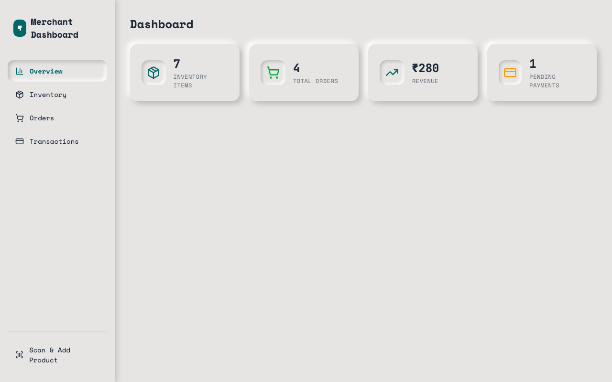
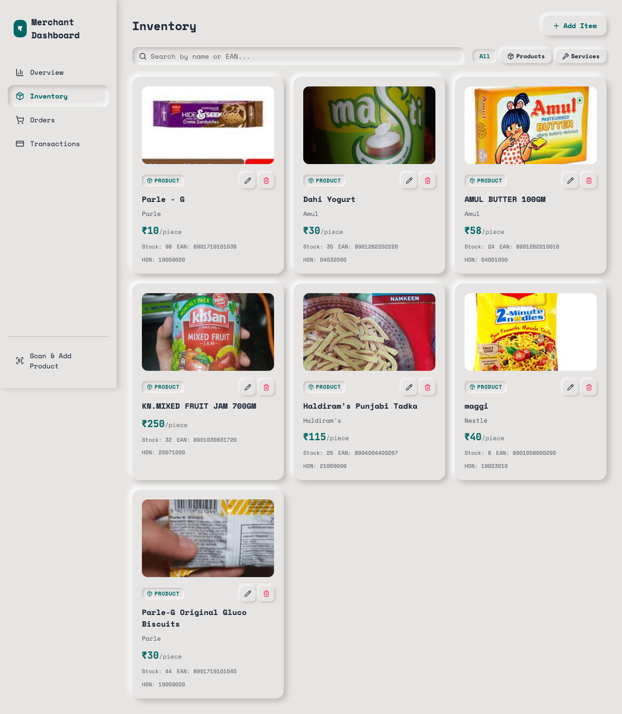
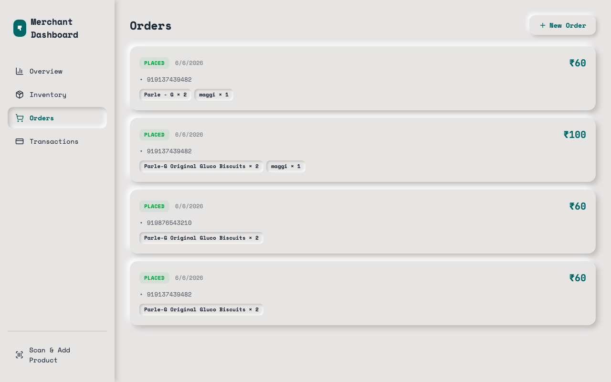
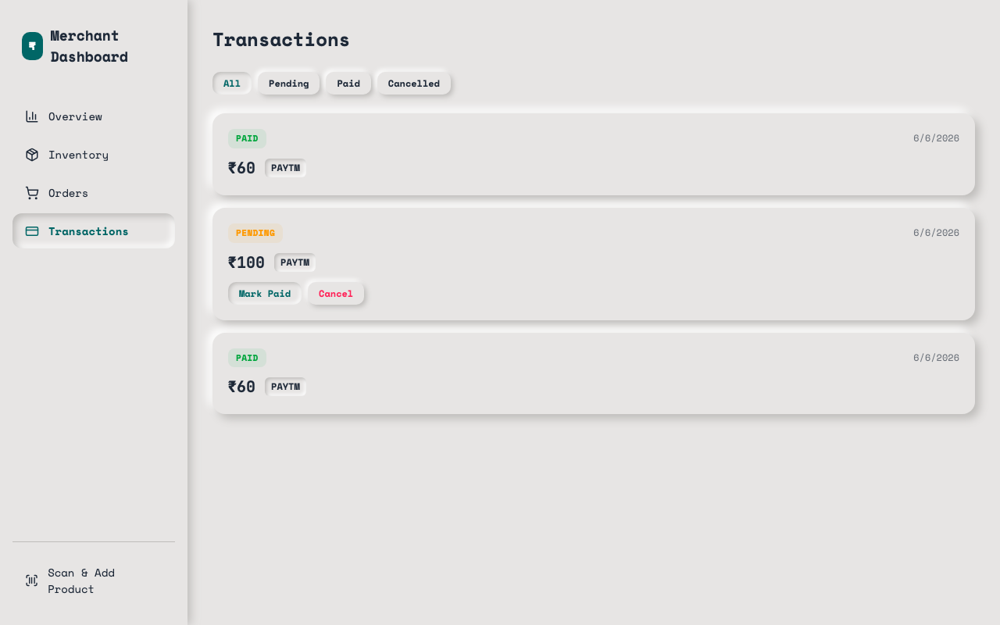
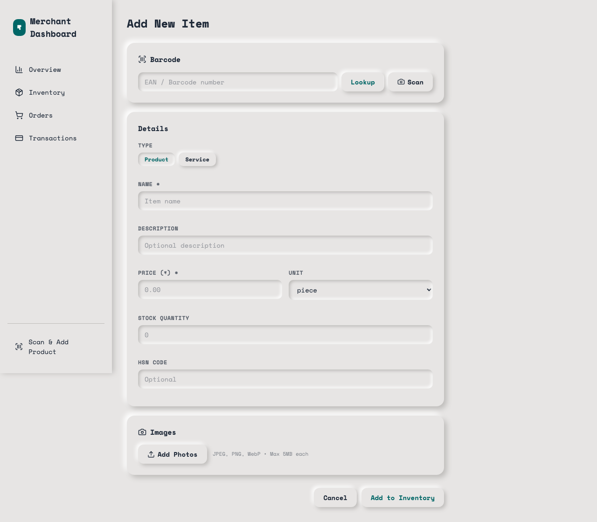
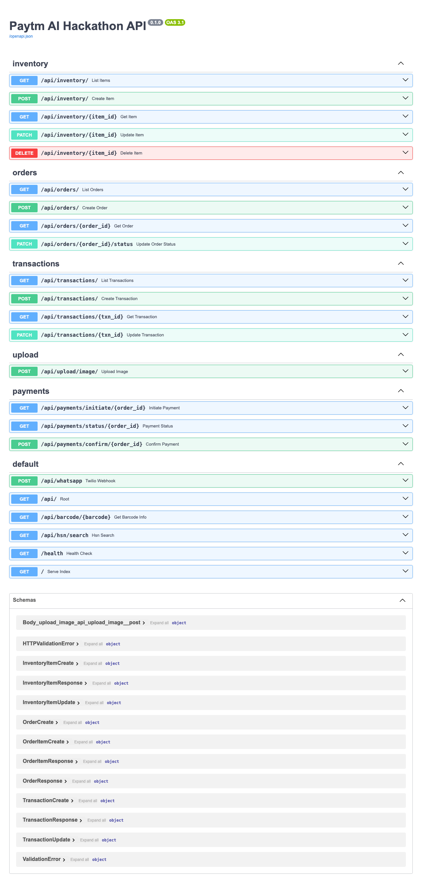

# 🛒 Paytm AI Hackathon — WhatsApp Commerce Assistant

An AI-powered WhatsApp shopping assistant for local Indian shopkeepers. Customers can browse inventory, place orders, and pay — all through natural conversation in **11 Indian languages**.

## ✨ Features

- **Multilingual AI Agent** — Powered by Sarvam's `sarvam-105b` LLM, supports Hindi, Bengali, Gujarati, Kannada, Malayalam, Marathi, Odia, Punjabi, Tamil, Telugu, and English
- **WhatsApp Commerce** — Full shopping flow (browse → order → pay) inside WhatsApp with zero app downloads
- **Image Understanding** — Customers can send photos of product labels, handwritten lists, or old bills — the AI reads and processes them via Sarvam Document Intelligence
- **Barcode Scanner** — Scan product barcodes to auto-fill inventory details (name, price, HSN code, images)
- **Paytm Payments** — Integrated payment links with Paytm checkout for seamless transactions
- **Merchant Dashboard** — Web UI for shopkeepers to manage inventory, track orders, and view transactions

## 📸 Screenshots

### Dashboard



### Inventory Management



### Orders



### Transactions



### Add Product (Barcode Scan)



### API Documentation



## 🏗️ Architecture

```
┌─────────────────┐     ┌──────────────────┐     ┌─────────────────┐
│   WhatsApp      │────▶│   Twilio Webhook  │────▶│   Sarvam LLM    │
│   (Customer)    │◀────│   (FastAPI)       │◀────│   (Agent+Tools) │
└─────────────────┘     └──────────────────┘     └─────────────────┘
                               │                         │
                               ▼                         ▼
                        ┌──────────────┐         ┌──────────────┐
                        │  Neon DB     │         │  Sarvam APIs │
                        │  (Postgres)  │         │  Vision/LID  │
                        └──────────────┘         └──────────────┘
                               │
                               ▼
                        ┌──────────────┐
                        │  React SPA   │
                        │  (Dashboard) │
                        └──────────────┘
```

## 🛠️ Tech Stack

| Layer      | Technology                                                  |
| ---------- | ----------------------------------------------------------- |
| AI/LLM     | Sarvam AI (sarvam-105b, Document Intelligence, Language ID) |
| Backend    | Python, FastAPI, LangChain, SQLAlchemy                      |
| Frontend   | React, TypeScript, Vite                                     |
| Database   | Neon (PostgreSQL)                                           |
| Messaging  | Twilio WhatsApp API                                         |
| Payments   | Paytm Payment Gateway                                       |
| Deployment | Render                                                      |

## 🚀 Setup & Development

### Prerequisites

- Python 3.11+
- Node.js 20+
- [uv](https://docs.astral.sh/uv/) (Python package manager)

### 1. Clone the repository

```bash
git clone https://github.com/kunalshah017/paytm-ai-hackathon.git
cd paytm-ai-hackathon
```

### 2. Backend Setup

```bash
cd server

# Create virtual environment and install dependencies
uv sync

# Copy environment file and fill in your keys
cp .env.example .env
# Edit .env with your credentials (see Environment Variables below)

# Run the server
uv run python run.py
```

The server starts at `http://localhost:8000`.

### 3. Frontend Setup

```bash
cd client

# Install dependencies
npm install

# Start dev server
npm run dev
```

The client starts at `http://localhost:5173` (proxied to backend).

### 4. Build for Production

```bash
# From project root
bash build.sh
```

This builds the React client and bundles it to be served by FastAPI.

### Environment Variables

Create a `.env` file in the `server/` directory:

```env
APP_ENV=development
DATABASE_URL=postgresql://<user>:<password>@<host>/<db>?sslmode=require

# Sarvam AI
SARVAM_API_KEY=your_sarvam_api_key

# Twilio (WhatsApp)
TWILIO_ACCOUNT_SID=your_account_sid
TWILIO_AUTH_TOKEN=your_auth_token
TWILIO_WHATSAPP_NUMBER=whatsapp:+14155238886

# Paytm Payment Gateway
PAYTM_MERCHANT_ID=your_merchant_id
PAYTM_MERCHANT_KEY=your_merchant_key
PAYTM_ENVIRONMENT=staging
```

### 5. WhatsApp Setup (Twilio)

1. Set up a [Twilio Sandbox for WhatsApp](https://www.twilio.com/docs/whatsapp/sandbox)
2. Set the webhook URL to `https://<your-domain>/api/whatsapp` (POST)
3. Use [Cloudflare Tunnel](https://developers.cloudflare.com/cloudflare-one/connections/connect-apps/) for local development:
   ```bash
   cloudflared tunnel --url http://localhost:8000
   ```

## 📡 API Endpoints

| Method   | Endpoint                 | Description               |
| -------- | ------------------------ | ------------------------- |
| `GET`    | `/health`                | Health check              |
| `GET`    | `/api/inventory/`        | List all inventory items  |
| `POST`   | `/api/inventory/`        | Add new inventory item    |
| `PUT`    | `/api/inventory/{id}`    | Update inventory item     |
| `DELETE` | `/api/inventory/{id}`    | Delete inventory item     |
| `GET`    | `/api/barcode/{ean}`     | Lookup product by barcode |
| `GET`    | `/api/orders/`           | List all orders           |
| `POST`   | `/api/orders/`           | Create new order          |
| `GET`    | `/api/transactions/`     | List all transactions     |
| `PATCH`  | `/api/transactions/{id}` | Update transaction status |
| `POST`   | `/api/whatsapp`          | Twilio WhatsApp webhook   |
| `POST`   | `/api/payments/initiate` | Initiate Paytm payment    |
| `POST`   | `/api/payments/confirm`  | Confirm payment           |

Full interactive API docs available at `/docs` (Swagger UI).

## 🤖 AI Agent Tools

The WhatsApp agent uses LangChain tool-calling with these capabilities:

- `search_inventory` — Search products by name
- `show_all_items` — List all available products
- `place_order` — Create an order for the customer
- `create_payment_link` — Generate a Paytm payment link
- `check_order_status` — Check order and payment status

## 📄 License

MIT
